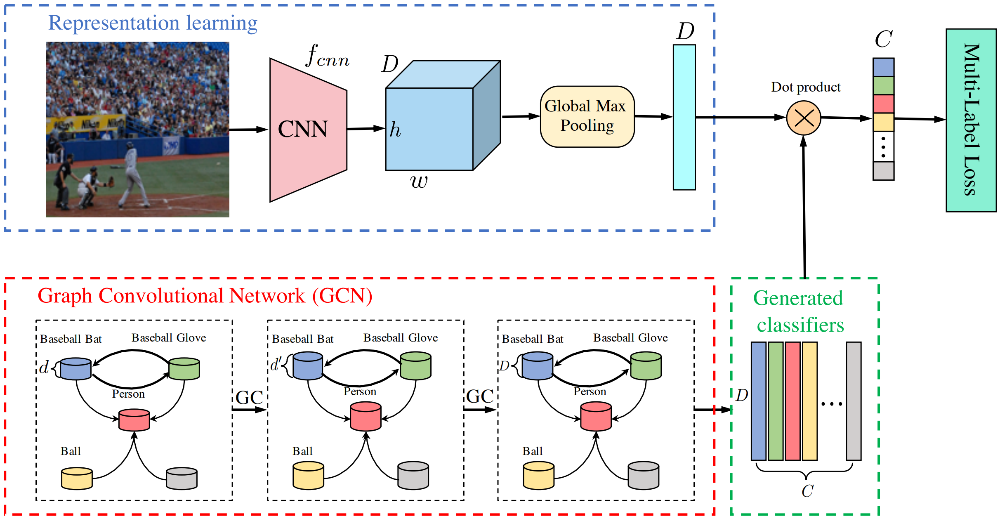
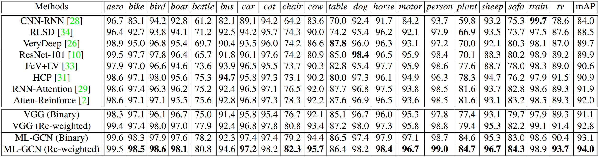

# ML-GCN_cvpr2019
 Unofficial PyTorch implementation of the paper "Multi-Label Image Recognition with Graph Convolutional Networks"


# Introdunction
Unofficial PyTorch  implementation of the paper ["Multi-Label Image Recognition with Graph Convolutional Networks"](https://openaccess.thecvf.com/content_CVPR_2019/html/Chen_Multi-Label_Image_Recognition_With_Graph_Convolutional_Networks_CVPR_2019_paper.html)

## Abstract
The task of multi-label image recognition is to predict a set of object labels that present in an image. As objects normally co-occur in an image, it is desirable to model the label dependencies to improve the recognition performance. To capture and explore such important dependencies, we propose a multi-label classification model based on Graph Convolutional Network (GCN). The model builds a directed graph over the object labels, where each node (label) is represented by word embeddings of a label, and GCN is learned to map this label graph into a set of inter-dependent object classifiers. These classifiers are applied to the image descriptors extracted by another sub-net, enabling the whole network to be end-to-end trainable. Furthermore, we propose a novel re-weighted scheme to create an effective label correlation matrix to guide information propagation among the nodes in GCN. Experiments on two multi-label image recognition datasets show that our approach obviously outperforms other existing state-of-the-art methods. In addition, visualization analyses reveal that the classifiers learned by our model maintain meaningful semantic topology. 

## Architecture
Overall framework of ML-GCN model for multi-label image recognition


## Results on MS-COCO:


## Results on VOC2007:


# BibTex
```
@InProceedings{Chen_2019_CVPR,
author = {Chen, Zhao-Min and Wei, Xiu-Shen and Wang, Peng and Guo, Yanwen},
title = {Multi-Label Image Recognition With Graph Convolutional Networks},
booktitle = {Proceedings of the IEEE/CVF Conference on Computer Vision and Pattern Recognition (CVPR)},
month = {June},
year = {2019}
} 